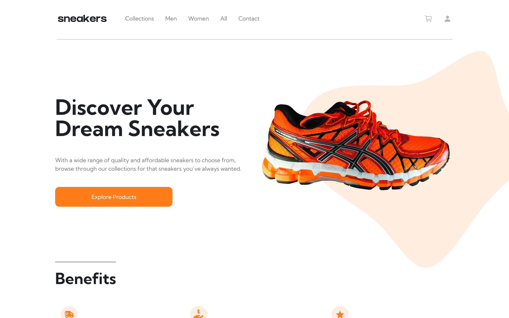

# Frontend Mentor - E-commerce product page solution

## How to start

```
npm run install-all
```
```
npm run dev
```

## Table of contents

- [Overview](#overview)
  - [The challenge](#the-challenge)
  - [Screenshot](#screenshot)
- [My process](#my-process)
  - [Built with](#built-with)
  - [Continued development](#continued-development)
  - [Useful resources](#useful-resources)


## Overview

### The challenge

Users should be able to:

- Register and login
- Create cart, address, and order
- Update and delete cart and address, update password, cart, user info, and address
- View the optimal layout for the site depending on their device's screen size
- See hover states for all interactive elements on the page
- Open a lightbox gallery by clicking on the large product image
- Switch the large product image by clicking on the small thumbnail images
- Add items to the cart
- View the cart and remove items from it

### Screenshot



## Process

### Built with

- Semantic HTML5 markup
- Mobile-first workflow
- [React](https://reactjs.org/) - JS library
- [Tailwindcss](https://tailwindcss.com/) - CSS framework
- [Ionicons](https://ionicons.com) - Icons
- [MongoDB](https://www.mongodb.com/) - NoSQL database
- [Nodejs](https://nodejs.org/) - Back-end JavaScript runtime environment
- [Express](https://expressjs.com/) - Nodejs framework
- [Stripe](http://stripe.com/) - Online payment service provider 
- [Heroku](https://www.heroku.com/) -  Cloud Application Platform
- [Redux Toolkit](https://redux-toolkit.js.org/) - Toolset for efficient Redux development

### Useful resources

- [Lama Dev](https://www.youtube.com/c/lamadev)
- [Dribble](dribbble.com)
- [Logrocket](https://blog.logrocket.com/handling-user-authentication-redux-toolkit/)
- [Unsplash](https://unsplash.com/)
- [Stack Overflow](https://stackoverflow.com)
